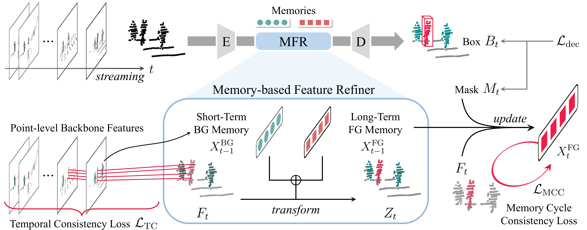
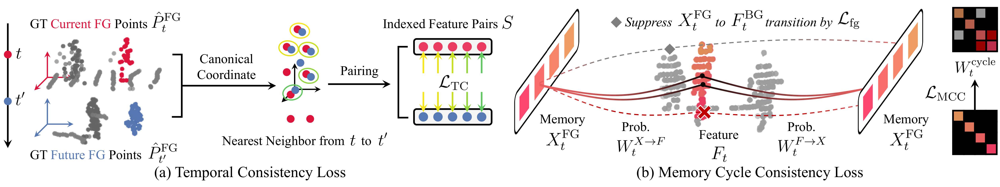

# ChronoTrack

**Temporally Consistent Long-Term Memory for 3D Single Object Tracking** [[arXiv]](https://arxiv.org/abs/2604.13789)

> Jaejoon Yoo, SuBeen Lee, Yerim Jeon, Miso Lee, Jae-Pil Heo
>
> CVPR 2026 Findings

---

## Overview

<p align="center">
  
</p>

ChronoTrack is the first long-term memory framework for 3D single object tracking (3D-SOT).

**Problem.** Recent memory-based 3D-SOT methods store point-level features from a few past frames (typically 2–3) as reference templates.
Naïvely extending this memory to longer horizons degrades tracking accuracy due to *temporal feature inconsistency* — cosine similarity between a target's LiDAR features decreases as temporal distance grows, causing mismatches when attending to distant frames.
Furthermore, point-level storage grows proportionally with memory length, making long-term extension impractical.

**Solution.** ChronoTrack replaces per-point feature storage with a compact set of **learnable foreground memory tokens** that are recurrently updated at each timestep. These tokens serve as a compressed, temporally persistent summary of the target's appearance. Short-term background context (single previous frame) is maintained separately to provide local scene contrast. Two novel training objectives ensure the tokens remain informative over long horizons:

<p align="center">
  
</p>

- **Temporal Consistency Loss (L_TC).** Foreground points from different frames are transformed into a shared canonical coordinate system (center subtracted, rotation applied). Nearest-neighbor pairs are found across frames and filtered by a distance threshold; SmoothL1 loss is applied to the corresponding feature pairs. This encourages part-level feature consistency across time, directly combating temporal feature drift.

- **Memory Cycle Consistency Loss (L_MCC).** A two-step cyclic walk — memory tokens → scene points → memory tokens — is performed via softmax cosine similarity. A cycle-consistency cross-entropy term penalizes tokens that fail to return to themselves, while a foreground affinity term encourages tokens to specialize in target-relevant regions. Together these losses push the tokens to encode diverse, target-specific semantics.

---

## Installation

### Option 1: Docker (Recommended)

We provide a pre-built Docker image with all dependencies installed.

```bash
docker pull jaejoonyoo/3dsot:chronotrack
```

### Option 2: Manual Setup

The codebase is tested with the following environment:

| Package | Version |
|---------|---------|
| Python | 3.10.14 |
| PyTorch | 2.3.1 |
| Torchvision | 0.18.1 |
| CUDA | 11.8 |
| PyTorch3D | 0.7.8 |
| Lightning | 2.4.0 |

```bash
# 1. Clone repository
git clone https://github.com/ujaejoon/ChronoTrack.git
cd ChronoTrack

# 2. Create conda environment
conda create -n chronotrack python=3.10
conda activate chronotrack

# 3. Install PyTorch (with CUDA 11.8)
pip install torch==2.3.1 torchvision==0.18.1 --index-url https://download.pytorch.org/whl/cu118

# 4. Install NumPy (must be pinned before other packages to avoid numpy 2.x conflicts)
pip install numpy==1.24.0

# 5. Install PyTorch3D (built from source; requires a C++ compiler and CUDA toolkit)
pip install "git+https://github.com/facebookresearch/pytorch3d.git@V0.7.8"

# 6. Install remaining dependencies
pip install lightning==2.4.0 addict==2.4.0 pyquaternion==0.9.9
pip install nuscenes-devkit==1.1.11 tensorboard==2.12.3
pip install pyyaml==6.0.1 pandas==1.5.3 tqdm==4.66.4
```

---

## Data Preparation

### KITTI

- Download the data for [velodyne](http://www.cvlibs.net/download.php?file=data_tracking_velodyne.zip), [calib](http://www.cvlibs.net/download.php?file=data_tracking_calib.zip) and [label_02](http://www.cvlibs.net/download.php?file=data_tracking_label_2.zip) from [KITTI Tracking](http://www.cvlibs.net/datasets/kitti/eval_tracking.php).

- Unzip the downloaded files and organize as follows:

  ```
  [Parent Folder]
  --> [calib]
      --> {0000-0020}.txt
  --> [label_02]
      --> {0000-0020}.txt
  --> [velodyne]
      --> [0000-0020] folders with velodyne .bin files
  ```

### NuScenes

- Download the dataset from the [download page](https://www.nuscenes.org/download).

- Extract the downloaded files and make sure you have the following structure:

  ```
  [Parent Folder]
    samples   -   Sensor data for keyframes.
    sweeps    -   Sensor data for intermediate frames.
    maps      -   Folder for all map files: rasterized .png images and vectorized .json files.
    v1.0-*    -   JSON tables that include all the meta data and annotations. Each split (trainval, test, mini) is provided in a separate folder.
  ```

> Note: We use the **train_track** split to train our model and test it with the **val** split. Both splits are officially provided by NuScenes. During testing, we ignore the sequences where there is no point in the first given bbox.

### Waymo

- We follow the benchmark created by [LiDAR-SOT](https://github.com/TuSimple/LiDAR_SOT) based on the Waymo Open Dataset. You can download and process the Waymo dataset as guided by [LiDAR_SOT](https://github.com/TuSimple/LiDAR_SOT), and use our code to test model performance on this benchmark.

- The following processing results are necessary:

  ```
  [waymo_sot]
      [benchmark]
          [validation]
              [vehicle]
                  bench_list.json
                  easy.json
                  medium.json
                  hard.json
              [pedestrian]
                  bench_list.json
                  easy.json
                  medium.json
                  hard.json
      [pc]
          [raw_pc]
              Here are some segment.npz files containing raw point cloud data
      [gt_info]
          Here are some segment.npz files containing tracklet and bbox data
  ```

Update `data_root_dir` in the corresponding config files to point to your data paths.

---

## Training

All models were trained using 2x NVIDIA RTX 4090 or RTX 3090 GPUs.

```bash
# KITTI - Car
python main.py configs/kitti/chronotrack_kitti_car.yaml --gpus 0 1 --phase train

# NuScenes - Car
python main.py configs/nuscenes/chronotrack_nuscenes_car.yaml --gpus 0 1 --phase train
```

**Arguments:**

| Argument | Description | Default |
|---|---|---|
| `config` | Path to config file | required |
| `--gpus` | GPU device indices | required |
| `--phase` | `train` or `test` | `train` |
| `--workspace PATH` | Directory to save checkpoints and logs | `./workspace` |
| `--run_name NAME` | Name for this run (used as subdirectory under workspace) | config filename |
| `--resume_from PATH` | Path to checkpoint file to resume from | `None` |
| `--seed SEED` | Random seed | `None` |
| `--debug` | Debug mode (10 epochs, batch size 2/GPU, no checkpoint saved) | `False` |

---

## Evaluation

```bash
# KITTI - Car
python main.py configs/kitti/chronotrack_kitti_car.yaml --phase test --gpus 0 \
    --resume_from /path/to/checkpoint.ckpt

# NuScenes - Car
python main.py configs/nuscenes/chronotrack_nuscenes_car.yaml --phase test --gpus 0 \
    --resume_from /path/to/checkpoint.ckpt

# Waymo - Vehicle
python main.py configs/waymo/chronotrack_waymo_vehicle.yaml --phase test --gpus 0 \
    --resume_from /path/to/checkpoint.ckpt
```

---

## Model Zoo

> **TODO:** Upload checkpoint files and add download links.

| Dataset | Category | Config | Checkpoint |
|---------|----------|--------|------------|
| KITTI | Car | [chronotrack_kitti_car.yaml](configs/kitti/chronotrack_kitti_car.yaml) | TBD |
| KITTI | Pedestrian | [chronotrack_kitti_ped.yaml](configs/kitti/chronotrack_kitti_ped.yaml) | TBD |
| KITTI | Van | [chronotrack_kitti_van.yaml](configs/kitti/chronotrack_kitti_van.yaml) | TBD |
| KITTI | Cyclist | [chronotrack_kitti_cyc.yaml](configs/kitti/chronotrack_kitti_cyc.yaml) | TBD |
| NuScenes | Car | [chronotrack_nuscenes_car.yaml](configs/nuscenes/chronotrack_nuscenes_car.yaml) | TBD |
| NuScenes | Pedestrian | [chronotrack_nuscenes_ped.yaml](configs/nuscenes/chronotrack_nuscenes_ped.yaml) | TBD |
| NuScenes | Truck | [chronotrack_nuscenes_truck.yaml](configs/nuscenes/chronotrack_nuscenes_truck.yaml) | TBD |
| NuScenes | Bus | [chronotrack_nuscenes_bus.yaml](configs/nuscenes/chronotrack_nuscenes_bus.yaml) | TBD |
| NuScenes | Trailer | [chronotrack_nuscenes_trailer.yaml](configs/nuscenes/chronotrack_nuscenes_trailer.yaml) | TBD |
| Waymo | Vehicle | [chronotrack_waymo_vehicle.yaml](configs/waymo/chronotrack_waymo_vehicle.yaml) | TBD |
| Waymo | Pedestrian | [chronotrack_waymo_pedestrian.yaml](configs/waymo/chronotrack_waymo_pedestrian.yaml) | TBD |

---

## Citation

```bibtex
@misc{yoo2026temporallyconsistentlongtermmemory,
      title={Temporally Consistent Long-Term Memory for 3D Single Object Tracking},
      author={Jaejoon Yoo and SuBeen Lee and Yerim Jeon and Miso Lee and Jae-Pil Heo},
      year={2026},
      eprint={2604.13789},
      archivePrefix={arXiv},
      primaryClass={cs.CV},
      url={https://arxiv.org/abs/2604.13789},
}
```

---

## Acknowledgements

This codebase is built upon [MBPTrack](https://github.com/slothfulxtx/MBPTrack3D). We thank the authors for their open-source contribution.
